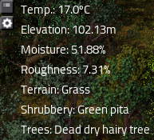

# evo_elev_temp

Elevation and Temperature sensors for [EvoGUI](https://github.com/narc0tiq/evoGUI)

License: MIT

Notes:

* Sensors are hard-coded to player 1 position
* Temperature does not change based on time of day! It seems to be fixed for each tile at time of map generation.
